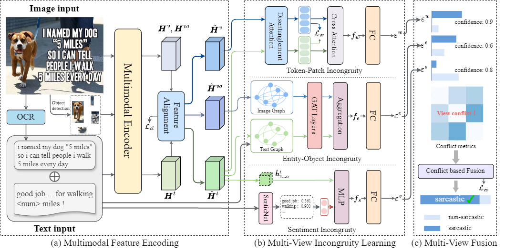

# ConDi

## Towards Generalized Multimodal Sarcasm Detection with Multi-View Learning


Multimodal Sarcasm Detection (MSD) is a crucial task for understanding complex human communication and building intelligent emotional computing systems. However, existing MSD methods commonly suffer from an over-reliance on spurious correlations, causing the learned features to deviate from the true semantics of sarcasm. This bias severely compromises the generalization ability of current models beyond the training environment. This paper proposes a **Con**fict-based **Di**sentangled multi-view incongruity learning framework (ConDi), aiming to effectively disentangle and interact with heterogeneous features in multimodal sarcasm. Given that multimodal embedding spaces are typically heterogeneous, direct fusion can disrupt the inherent structure of embeddings from different modalities. To address this issue, we employ the optimal transport algorithm to align embeddings from different modalities into a unified space. Subsequently, we jointly learn incongruities from three views: modality disentanglement, global sentiment, and local description. To achieve a debiased fusion of sarcasm features, we design a conflict-based fusion module to integrate features from these three views. Experimental results demonstrate the superiority of ConDi on multimodal sarcasm datasets, and further analysis shows that ConDi can effectively reduce reliance on spurious correlations. Additionally, out-of-distribution (OOD) experiments reveal that ConDi achieves better generalization.

## Data
All data will be uploaded via Google Drive.

Original data can be found in [1](https://drive.google.com/file/d/1mK0Nf-jv_h2bgHUCRM4_EsdTiiitZ_Uj/view?usp=sharing_eil&ts=5d480e04) [2](https://drive.google.com/file/d/1AOWzlOz5hmdO39dEmzhQ4z_nabgzi7Tu/view?usp=sharing_eil&ts=5d480e04) [3](https://drive.google.com/file/d/1dJERrVlp7DlNSXk-uvbbG6Rv7uvqTOKd/view?usp=sharing_eil&ts=5d480e04) [4](https://drive.google.com/file/d/1pODuKC4gP6-QDQonG8XTqI8w8ds68mE3/view?usp=sharing_eil&ts=5d480e04).

Processed data will be uploaded as soon as it is organized.


## Usage
```
python3 main.py --name mmsd --model MIDL --text_name text_json_clean --weight_decay 0.08 --train_batch_size 128 --dev_batch_size 128 --learning_rate 6e-4 --num_train_epochs 20 --layers 3 --max_grad_norm 5 --dropout_rate 0.1 --optimizer_name adam --text_size 512 --image_size 768 --warmup_proportion 0.2 --device 0
```
